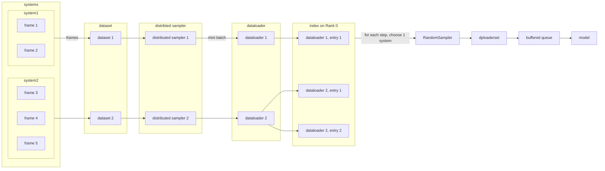

# DeePMD-PyTorch

DeePMD is a deep learning-based interatomic potential energy and force field. The original [DeePMD-kit](https://github.com/deepmodeling/deepmd-kit) implementation is based on TensorFlow. This repository brings prior features for training, testing, and performing molecular dynamics (MD) with DeePMD to PyTorch framework.
DeePMD-PyTorch also supports the multi-task pre-training of  DPA-2, a large atomic model (LAM) which can be efficiently fine-tuned and distilled to downstream tasks.

## Use DeePMD-PyTorch

### Install

This package requires PyTorch 2. Please refer to [PyTorch's official website](https://pytorch.org/) for installation instructions.
Since this repo is under active development, please use the `devel` branch.

```bash
# PyTorch 2 recommends Python >= 3.8 .
conda create -n deepmd-pt pytorch=2 torchvision torchaudio pytorch-cuda -c pytorch -c nvidia
conda activate deepmd-pt

pip install git+https://github.com/dptech-corp/deepmd-pytorch.git@devel
# OR
git clone https://github.com/dptech-corp/deepmd-pytorch.git -b devel
pip install deepmd-pytorch

# Check if the installation is successful
dp_pt -h
```

### Train a model

```bash
conda activate deepmd-pt
dp_pt train tests/water/se_e2_a.json
```

#### Distributed training on multiple GPUs

We use [`torchrun`](https://pytorch.org/docs/stable/elastic/run.html#usage) to launch a DDP training session.

To start training with multiple GPUs in one node, set parameter `nproc_per_node` as the number of it:

```bash
torchrun --nproc_per_node=4 --no-python dp_pt train input.json
# Not setting `nproc_per_node` uses only 1 GPU by default
```

To train a model with a cluster, one can manually launch the task using the commands below (usually this should be done by your job management system). Set `nnodes` as the number of available nodes, `node_rank` as the rank of the current node among all nodes (not the rank of processes!), and `nproc_per_node` as the number of available GPUs in one node. Please make sure that every node can access the rendezvous address and port (`rdzv_endpoint` in the command), and has a same amount of GPUs.

```bash
# Running DDP on 2 nodes with 4 GPUs each
# On node 0:
torchrun --rdzv_endpoint=node0:12321 --nnodes=2 --nproc_per_node=4 --node_rank=0 --no_python dp train tests/water/se_e2_a.json
# On node 1:
torchrun --rdzv_endpoint=node0:12321 --nnodes=2 --nproc_per_node=4 --node_rank=1 --no_python dp train tests/water/se_e2_a.json
```

> **Note** Set environment variables to tune [CPU specific optimizations](https://pytorch.org/tutorials/recipes/recipes/tuning_guide.html#cpu-specific-optimizations) in advance.

> **Note** for developers: `torchrun` by default passes settings as environment variables [(list here)](https://pytorch.org/docs/stable/elastic/run.html#environment-variables).

> To check forward, backward, and communication time, please set env var `TORCH_CPP_LOG_LEVEL=INFO TORCH_DISTRIBUTED_DEBUG=DETAIL`. More details can be found [here](https://pytorch.org/docs/stable/distributed.html#logging).

If your cluster is managed by SLURM, use the following command to launch the training task:

```bash
# Don't forget to modify your cluster info in the script!
cd slurm && sbatch distributed_data_parallel_slurm_setup.sbatch
```

Files under `slurm` directory are modified from <https://github.com/lkskstlr/distributed_data_parallel_slurm_setup>.

#### Track training progress using Weight & Biases

[Weight & Biases](https://wandb.ai/) helps to track the convergence of loss curves and validation results in the training progress.

The command line entry `wandb` is automatically installed as a requirement for DeePMD-PyTorch.

First, setup with `wandb login`, and set the corresponding fields under the "training" part in your input file (typically `input.json`) as follows:

```jsonc
// "training": {
    "wandb_config": {
        "job_name": "Cu-dpa_adam_bz1_at2",
        "wandb_enabled": true,
        "entity": "dp_model_engineering", // a username or team name
        "project": "DPA"
    },
```

Track your runs at <https://wandb.ai/dp_model_engineering/DPA>.
To disable logging temporarily, set environment variable `WANDB_MODE=disabled`.

## Test

```bash
dp_pt test -m model.pt -s path_to_system -n 100
dp_pt test -m model.pt -f path_to_system_file -n 100
dp_pt test -m model.pt -i path_to_input_script -n 100
```

## Running molecular dynamics with LAMMPS

### Install LAMMPS and the DeePMD-PyTorch extension

```bash
conda activate deepmd-pt # This env has `dp_pt` installed
conda install lammps eigen
# We use conda to install the requirements for LAMMPS.
# The LAMMPS executable is not used since source code modification is required.

# Build deepmd C API
export CMAKE_PREFIX_PATH=`python -c "import torch;print(torch.utils.cmake_prefix_path)"`:$CONDA_PREFIX/share/eigen3/cmake:$CMAKE_PREFIX_PATH
git clone https://github.com/dptech-corp/deepmd-pytorch.git -b devel
cd deepmd-pytorch/source/api_cc
cmake -B build
cmake --build build -j

# Build lammps supporting deepmd pair style
cd -
git clone https://github.com/CaRoLZhangxy/lammps
# See modifications: https://github.com/CaRoLZhangxy/lammps/commit/27347ce4a17d13eeb634ee1c4e5fd0cc687c423f
# OR: clone lammps/lammps, move cmake/CMakeLists.txt from CaRoLZhangxy/lammps and deepmd-pytorch/source/lmp from deepmd-pytorch

# https://docs.lammps.org/Build_cmake.html#getting-started
cd lammps
mkdir build; cd build
cmake ../cmake/ -DPKG_DEEPMD=ON -DPKG_MOLECULE=ON \
    -DDEEPMD_INCLUDE_PATH=../../deepmd-pytorch/source/api_cc/include \
    -DDEEPMD_LIB_PATH=../../deepmd-pytorch/source/api_cc/build
cmake --build . -j`nproc`
make install
# install to `~/.local/bin/lmp` by default; shadows `lmp_mpi` from conda

# TODO: Plugin mode: NOT implemented yet
# https://docs.lammps.org/plugin.html#description
# export LAMMPS_PLUGIN_PATH=$HOME/deepmd-pytorch/source/api_cc/build
```

### Run MD

```bash
conda activate deepmd-pt
export PATH=$HOME/.local/bin:$PATH
export LD_LIBRARY_PATH=`python -c "import torch;print(torch.__path__[0])"`/lib:`realpath ../../deepmd-pytorch/source/api_cc/build`:$LD_LIBRARY_PATH
cd test_example/water_768/
lmp -in sea_in.lammps
```

## Acknowledgement

- Original [DeePMD-kit](https://github.com/deepmodeling/deepmd-kit) based on TensorFlow
- [DeePMD on PyTorch demo](https://github.com/shishaochen/deepmd_on_pytorch) by Shaochen Shi

## Developing

If you wish to execute the codes under active development without `pip install`ing, set environment variable `PYTHONPATH`:

```bash
PYTHONPATH=./deepmd-pytorch dp_pt train input.json
```

### Profiling

```bash
# you may change the number of training steps before profiling
python -m cProfile -o profile deepmd-pytorch/deepmd_pt/entrypoints/main.py train tests/water/se_e2_a.json 2>&1
python -m pstats
```

### Distributed Data Parallelism

Currently, we support input files in traditional dp format. We construct a PyTorch DataSet for each system, and fetch batched data with a dedicated DataLoader. This guarantee the input data for one rank in one mini-batch comes from same system, i.e. has a same number of atoms, which is required by the model. Using [`DistributedSampler`](https://pytorch.org/docs/stable/data.html#torch.utils.data.distributed.DistributedSampler), each frame is extracted for training once and only once in one epoch, no matter how many ranks there are.

The systems vary in length, and the number of mini-batches we can get from that DataLoader differs. A index table is created on each rank, and for each DataLoader, its index value is appended to the index array in the number of the length of the DataLoader. In pseudocodes:

```python
self.index: List[int] = []
self.dataloaders: List[DataLoader] = []
for system in systems:
    dl = create_dataloader(system)
    self.dataloaders.append(dl)
    for _ in range(len(dl)): # len(dl) == how many mini-batches in this system
        index.append(len(self.dataloaders) - 1)
```

We initialize a meta-dataset named `dploaderset` with the index. Each step draws out an index randomly using `RandomSampler`, and fetch data from the corresponding DataLoader. Hence, in one epoch, the number of every DataLoader being accessed equals the length of it, which means that all input frames are accessed without omitting.



For more details, please see `deepmd-pytorch/deepmd_pt/utils/dataloader.py`.
