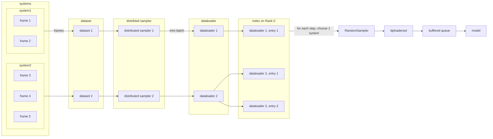

This repository is written by Hang'rui Bi based on Shaochen Shi's implementation of DeePMD-kit using PyTorch.
It is supposed to offer comparable accuracy and performance to the TF implementation.

# Quick Start

## Install

This package requires PyTorch 2.
```bash
# PyTorch 2 recommends Python >= 3.8 .
conda create -n deepmd-pt python=3.10
conda activate deepmd-pt
# Following instructions on pytorch.org
conda install pytorch torchvision torchaudio pytorch-cuda=11.7 -c pytorch -c nvidia
git clone https://github.com/dptech-corp/deepmd-pytorch.git
pip install deepmd-pytorch

# ... or
pip install git+https://github.com/dptech-corp/deepmd-pytorch.git
```

## Run

```bash
conda activate deepmd-pt
python3 deepmd_pt/entrypoints/main.py train  tests/water/se_e2_a.json
```

# Profiling

```bash
# you may change the number of training steps before profiling
PYTHONPATH=/root/deepmd_on_pytorch python3 -m cProfile -o profile deepmd_pt/main.py train tests/water/se_e2_a.json 2>&1
python -m pstats
```

# References

- Original DeePMD-kit on TensorFlow https://github.com/deepmodeling/deepmd-kit
- DeePMD on PyTorch demo https://github.com/shishaochen/deepmd_on_pytorch

# Structure

```
# deepmd_pt
entrypoints
    main.py
train
    train.py
infer
    inference.py
model
    model.py
    descriptor
        descriptor.py
        embedding_net.py
    task
        fitting.py
loss
    loss.py
optimizer
    LKF.py
    KFWrapper.py
utils
    dataset.py
    env.py
    learning_rate.py
    my_random.py
    stat.py
```

# Deploy

This test requires cuda toolkit to be installed locally. Verify if `nvcc -V` presents.
`deploy/test_model.cpp` illustrates the model interface in C++.
You may need to modify `SEL` in `test_model.cpp`, 138 for water example se_a, 40 for water example DPA1.

```bash
cd deploy
export CMAKE_PREFIX_PATH=`python -c "import torch;print(torch.__path__[0])"`/share/cmake:$CMAKE_PREFIX_PATH
cmake -B build
cmake --build build

# run traninig with JIT=True to dump a torchscript frozen model
python deepmd_pt/entrypoints/main.py train tests/water/se_e2_a.json
./build/test ../frozen_model.pth 
```

# Test
First modify TEST_CONFIG in env.py to the input config you want to test. For example, `tests/water/se_e2.json` is the config for a tiny water problem. The water dataset is contained in the repository.

The tests are aligned with deepmdkit 2.1.5, may fail with deepmdkit 2.2 or higher.

# Distributed Data Parallelism

Currently, we support input files in traditional dp format. We construct a PyTorch DataSet for each system, and fetch batched data with a dedicated DataLoader. This guarantee the input data for one rank in one mini-batch comes from same system, i.e. has a same number of atoms, which is required by the model. Using [`DistributedSampler`](https://pytorch.org/docs/stable/data.html#torch.utils.data.distributed.DistributedSampler), each frame is extracted for training once and only once in one epoch, no matter how many ranks there are.

The systems vary in length, and the number of mini-batches we can get from that DataLoader differs. A index table is created on each rank, and for each DataLoader, its index value is appended to the index array in the number of the length of the DataLoader. In pseudocodes:

```python
self.index: List[int] = []
self.dataloaders: List[DataLoader] = []
for system in systems:
    dl = create_dataloader(system)
    self.dataloaders.append(dl)
    for _ in range(len(dl)): # len(dl) == how many mini-batches in this system
        index.append(len(self.dataloaders) - 1)
```

We initialize a meta-dataset named `dploaderset` with the index. Each step draws out an index randomly using `RandomSampler`, and fetch data from the corresponding DataLoader. Hence, in one epoch, the number of every DataLoader being accessed equals the length of it, which means that all input frames are accessed without omitting.



For more details, please see `deepmd-pytorch/deepmd_pt/utils/dataloader.py`.

## Run on a local cluster

We use [`torchrun`](https://pytorch.org/docs/stable/elastic/run.html#usage) to launch a DDP training session.

To start training with multiple GPUs in one node, set parameter `nproc_per_node` as the number of it:

```bash
torchrun --nproc_per_node=4 --no-python dp_pt train input.json
# Not setting `nproc_per_node` uses only 1 GPU
torchrun --no-python dp_pt train input.json
```

If you wish to execute the codes under active development without `pip install`ing, please try:

```bash
PYTHONPATH=~/deepmd-pytorch torchrun ~/deepmd-pytorch/deepmd_pt/entrypoints/main.py train input.json
```

To train a model with a cluster, one can manually launch the task using the commands below (usually this should be done by your job management system). Set `nnodes` as the number of available nodes, `node_rank` as the rank of the current node among all nodes (not the rank of processes!), and `nproc_per_node` as the number of available GPUs in one node. Please make sure that every node can access the rendezvous address and port (`rdzv_endpoint` in the command), and has a same amount of GPUs.

```bash
# Running DDP on 2 nodes with 4 GPUs each
# On node 0:
torchrun --rdzv_endpoint=node0:12321 --nnodes=2 --nproc_per_node=4 --node_rank=0 --no_python dp train tests/water/se_e2_a.json
# On node 1:
torchrun --rdzv_endpoint=node0:12321 --nnodes=2 --nproc_per_node=4 --node_rank=1 --no_python dp train tests/water/se_e2_a.json
```

> **Note** Set environment variables to tune [CPU specific optimizations](https://pytorch.org/tutorials/recipes/recipes/tuning_guide.html#cpu-specific-optimizations) in advance.

> **Note** for developers: `torchrun` by default passes settings as environment variables [(list here)](https://pytorch.org/docs/stable/elastic/run.html#environment-variables).

> To check forward, backward, and communication time, please set env var `TORCH_CPP_LOG_LEVEL=INFO TORCH_DISTRIBUTED_DEBUG=DETAIL`. More details can be found [here](https://pytorch.org/docs/stable/distributed.html#logging).

## Run on slurm system
Use .sbatch file in slurm/, you may need to modify some config to run on your system

```bash
sbatch distributed_data_parallel_slurm_setup.sbatch
```

These files are modified from: https://github.com/lkskstlr/distributed_data_parallel_slurm_setup

# Track runs using W&B

`wandb` is automatically installed as a requirement for deepmd-pytorch.

First setup with `wandb login`, and set the corresponding fields under the "training" part in your input file (typically `input.json`) as follows:

```jsonc
// "training": {
    "wandb_config": {
        "job_name": "Cu-dpa_adam_bz1_at2",
        "wandb_enabled": true,
        "entity": "dp_model_engineering", // a username or team name
        "project": "DPA-2"
    },
```

To disable logging temporarily, set env var `WANDB_MODE=disabled`.

# Known Problems & TODO
